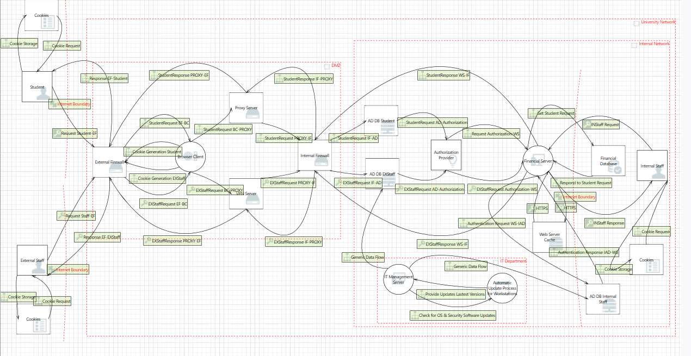

## Threat Modeling

  

## Attack Tree

  

# University Financial Portal Threat Model

**Repository Name:** University-Financial-Portal-Threat-Modeling

## Description

A comprehensive threat model for a University Financial Portal, designed using the Microsoft Threat Modeling Tool (TMT). This model focuses on securing communication, authentication, and data flow for both students and staff interacting with the financial system. The system integrates an existing internal financial platform with a newly developed web-based portal for students, emphasizing secure and straightforward access to financial services through modern security practices like Role-Based Access Control (RBAC) and encrypted connections.

## System Overview

The project encompasses:

* **Student Web Portal**: A new web-based portal for university students enabling secure HTTPS access (no VPN) for functionalities like viewing balances, payment history, managing payment accounts, and making payments. Student authentication is handled by a dedicated Active Directory (AD) domain.
* **Existing Financial System**: Accessed by staff via the internal network or a secure web portal (VPN required). Features include encrypted internal network traffic, encrypted database records for sensitive data, and staff authentication managed via a separate staff/faculty AD and GPO for application access.
* **Technical Setup**:
    * The student web portal server is located in the data center’s DMZ.
    * A Student AD Domain Controller is also implemented within the DMZ for student credential validation.
    * Encrypted connections are mandated between the web portal and internal resources (domain controllers, other servers).

## Threat Model Details

* **Tool Used**: Microsoft Threat Modeling Tool (TMT)
* **Threat Model Name**: University Financial System
* **Contributors**: Amer Ashoush- AmrElmaghraby - @Abdelrhman-abdelmoaty22 -OmarHamdy
* **Scope**: Includes threat modeling for:
    * The new Student Web Portal and its interactions.
    * Staff access to the existing financial system, including VPN access.
    * Data flows between DMZ components (Web Portal, Student AD) and internal university resources.
* **Assumptions**:
    * Proxy and VPN Servers are operating on the Linux kernel.
